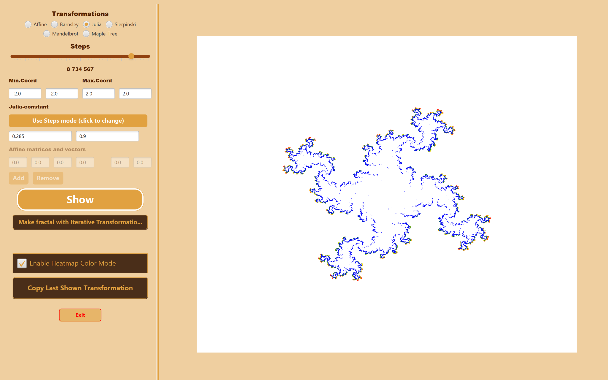

# Chaos Game

[](https://openjdk.java.net/projects/jdk/20/)
[](https://openjfx.io/)
[](https://maven.apache.org/)

A sophisticated JavaFX application for generating beautiful fractals using the Chaos Game algorithm. This project implements various transformation types including Affine transformations, Julia set generation, and classic fractal patterns like the Sierpinski triangle and Barnsley fern.



## ✨ Features

- **Multiple Transformation Types**: Supports Affine, Julia, Sierpinski, Barnsley, and Maple-Tree transformations
- **Interactive GUI**: User-friendly interface built with JavaFX
- **Customizable Parameters**: Adjust iterations, coordinates, and transformation parameters
- **Heatmap Visualization**: Color-coded pixel intensity to show fractal density
- **Iterative Mode**: Generate fractals using iterative transformation patterns
- **Real-time Preview**: Instant fractal generation and display
- **Configurable Settings**: Save and load application preferences

## 🚀 Getting Started

### Prerequisites

- Java 20 or higher
- Maven 3.8+
- JavaFX 20.0.2 (included as dependency)

### Installation

1. Clone the repository:
```bash
git clone <repository-url>
cd prog_2_prosjekt
```

2. Install dependencies:
```bash
mvn clean install
```

3. Run the application:
```bash
mvn javafx:run
```

## 🎮 User Guide

### Basic Usage

1. **Select Transformation**: Choose from available transformation types (Sierpinski, Barnsley, Julia, etc.)
2. **Configure Parameters**: Fill in the required fields for your selected transformation
3. **Set Coordinates**: Define minimum and maximum coordinates for the viewing area
4. **Adjust Steps**: Use the slider to set the number of iterations
5. **Generate**: Click "Show" to generate and display the fractal

### Transformation-Specific Settings

#### Sierpinski Triangle
- **Recommended coordinates**: Min: (0,0), Max: (1,1)
- Classic three-point fractal generator

#### Barnsley Fern
- **Recommended coordinates**: Min: (-4,-1), Max: (4,10)
- Creates beautiful fern-like patterns

#### Julia Set
- **Recommended coordinates**: Min: (-2,-2), Max: (2,2)
- **Real/Imaginary values**: Numbers between -0.9 and 0.9 work best
- Choose generation method using Julia constant buttons

#### Affine Transformations
- Define custom matrix and vector transformations
- Use "Add" and "Remove" buttons to manage multiple transformations
- At least one transformation row is always visible

### Advanced Features

| Feature | Description |
|---------|-------------|
| **Heatmap Mode** | Toggle checkbox to visualize pixel hit frequency |
| **Iterative Mode** | Generate fractals without random selection |
| **Copy Transformation** | Duplicate the last displayed transformation |
| **Coordinate Validation** | Empty fields highlighted in red for easy identification |

## 🏗️ Project Structure

```
src/
├── main/java/
│   ├── controller/          # Application controllers
│   │   ├── ChaosGameController.java
│   │   ├── HandleActionController.java
│   │   └── ValidationController.java
│   ├── model/              # Core mathematical models
│   │   ├── chaosgame/      # Chaos game implementation
│   │   ├── mathcore/       # Mathematical utilities (Vector2D, Matrix2x2, Complex)
│   │   ├── transformations/ # Transformation algorithms
│   │   ├── factory/        # Factory pattern implementations
│   │   └── filehandling/   # File I/O operations
│   ├── view/               # JavaFX UI components
│   ├── util/               # Utility classes
│   └── exception/          # Custom exceptions
└── test/java/              # Comprehensive test suite
    └── [mirror of main structure]
```

## 🧮 Mathematical Background

The Chaos Game is a method for generating fractals using:
- **Affine Transformations**: Linear transformations with translation
- **Julia Sets**: Complex number iterations using the formula z ← z² + c
- **Iterated Function Systems**: Collections of contractive mappings

Each transformation type creates unique fractal patterns through different mathematical approaches.

## 🛠️ Development

### Building the Project

```bash
# Compile the project
mvn compile

# Run tests
mvn test

# Generate documentation
mvn javadoc:javadoc

# Package the application
mvn package
```

### Testing

The project includes comprehensive unit tests covering:
- Mathematical operations (Vector2D, Matrix2x2, Complex numbers)
- Transformation algorithms
- File handling operations
- GUI components (using TestFX)

Run tests with:
```bash
mvn test
```

## 📋 Requirements

- **Java 20**: Modern Java features and performance improvements
- **JavaFX**: Rich desktop application framework
- **Maven**: Dependency management and build automation
- **JUnit 5**: Unit testing framework
- **TestFX**: JavaFX testing framework

## 👥 Authors

**Fredrik Nymoen & Amund Larsen**
- NTNU - Programming 2 Course Project
- IDATG2003-Programmering2

## 📄 License

This project is developed as part of the NTNU Programming 2 course curriculum.

## 🐛 Troubleshooting

### Common Issues

1. **JavaFX Module Issues**: Ensure JavaFX modules are properly configured
2. **Memory Issues**: For complex fractals, increase JVM heap size
3. **Performance**: Reduce iteration count for real-time interaction

### Getting Help

If you encounter issues:
1. Check that all required fields are filled (highlighted in red if empty)
2. Verify coordinate ranges match transformation type recommendations
3. Ensure Java 20+ is installed and configured correctly

---

*This fractal generator demonstrates advanced object-oriented programming concepts, mathematical modeling, and JavaFX GUI development.*